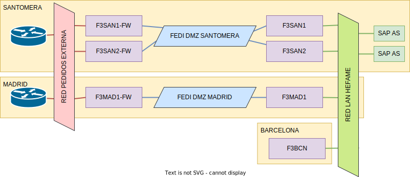

# Arquitectura de red

En esta sección vamos a detallar la arquitectura de red utilizada para la comunicación entre servidores.
A un nivel alto de abstracción, este es el esquema de red que tiene la infraestructura.

Se puede observar como quedan repartidos los grupos de balanceadores y concentradores Fedicom3 en las distintas sedes de Hefame, y las redes que estos utilizarán para comunican entre sí, con los clientes y con los servidores SAP.

# Red de PEDIDOS EXTERNA

La red de PEDIDOS EXTERNA es la que permite que los clientes sean capaces de llegar a la red de servidores Fedicom 3.
Los balanceadores de carga se conectan directamente a esta red y comparten una dirección IP virtual que es la de acceso al servicio: *`(oculto)`*. Además de esta IP virtual, cada concentrador tiene su IP de mantenimiento:
- **f3san1-fw**: *`(oculto)`*
- **f3san2-fw**: *`(oculto)`*
- **f3mad1-fw**: `n/a`. Como veremos, dado el método de alta disponibilidad utilizado, este nodo no tiene red salvo que la sede de Santomera caiga por completo, por tanto, no tiene sentido darle una IP para mantenimiento.

Se han implementado 2 mecanismos para permitir que todos los balanceadores tengan la misma IP sin que esto provoque mal funcionamiento de la red IP:
- Para la gestión de la IP entre las máquinas de una misma sede, como es el caso de Santomera, utilizaremos el protocolo VRRP (*Virtual Router Redundancy Protocol*). Este servicio utiliza los mecanismos a nivel de enlace de la red para, mediante el uso de paquetes `ARP` y el direccionamiento multicast (a nivel de enlace), determinar el estado de salud de los balanceadores conectados al mismo enlace de red, y levantar la IP en el que convenga.
- Para la gestión de la IP entre máquinas de distintas sedes lo que se ha hecho es activar la misma IP en ambas sedes, habiendo configurado los routers de VODAFONE para que la IP se anuncie en ambas ubicaciones con distinto peso.

Así pues, la configuración de las interfaces en esta red es la que se muestra en el siguiente diagrama:

:::info
La dirección IP de servicio es la misma tanto en Madrid como en Santomera, **la máscara de red y la dirección del gateway por defecto es distinta.**
Esto se debe a que la red pública de Hefame está dividida en dos segmentos. Ambos segmentos se anuncian desde el router de Santomera, pero sólo el primero es anunciado también desde el router de Madrid, que indica un peso mayor para la ruta.
:::

# Redes DMZ

Las redes DMZ son las que interconectan a los distintos balanceadores y conentradores del sistema **dentro de cada sede**.
:::caution
Cada sede tiene su propia DMZ aislada, por lo que no puede haber comunicación entre sedes utilizando esta red.
:::

Cuando los balanceadores reciben peticiones de los clientes, estos balancean las peticiones entre los distintos balanceadores utilizando estas redes.

En concreto, vamos a utilizar redes de la forma `192.168.10.X/28`, tal que:

| Sede      | Dirección de red | Rango usable para Fedicom3    | Puerta enlace | Broadcast     |
| --------- | ---------------- | ----------------------------- | ------------- | ------------- |
| Santomera | `192.168.10.0/22`  | `192.168.10.1 - 192.168.10.13`  | `192.168.10.14` | `192.168.10.15` |
| Madrid    | `192.168.10.16/22` | `192.168.10.17 - 192.168.10.29` | `192.168.10.30` | `192.168.10.31` |

  
# LAN Hefame

La LAN Hefame permite la interconexión de máquinas entre las distintas sedes de manera interna.

A través de esta red los concentradores son capaces de alcanzar a los distintos servidores SAP y las instancias de la base de datos se sincronizan.

Adicionalmente, dado que el balanceador de Madrid no dispone de acceso a internet de forma habitual (solo podrá operar en la red Vodafone cuando Santomera esté caído), se le dejará configurada un interfaz de red conectada a la red LAN, que se habilitará esporádicamente para tareas de mantenimiento como actualizaciónes, sincronización de NTP, etc ...

