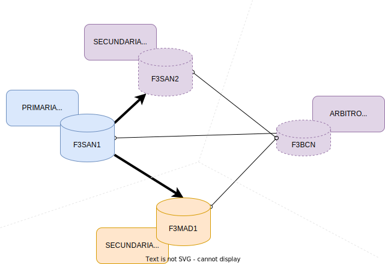

# Inicializacion del ReplicaSet
Como queremos bridar de alta disponibilidad al sistema de base de datos, vamos a desplegar una base de datos MongoDB con replica de los datos en diferentes nodos. Esto es lo que se conoce como un _ReplicaSet_.

Partimos de que tenemos MongoDB configuradas exactamente como hemos explicado en [el manual de instalacion](./instalacion).

:::danger
El fichero `/var/lib/mongo/mongo.key` debe ser exactamente el mismo en todas las instancias y tener los permisos adecuados.
:::

```bash
scp f3san1:/var/lib/mongo/mongo.key /var/lib/mongo/mongo.key
chmod 400 /var/lib/mongo/mongo.key
chown mongod:mongod /var/lib/mongo/mongo.key
```


Como vimos en la introducción a MongoDB, desplegaremos 4 instancias MongoDB formando un ReplicaSet, tal que el dibujo final quede como en el esquema:



## Configuración previa de los nodos

Para cada uno de los nodos que vayan a conformar el clúster, es preciso que el su fichero `/etc/mongod.conf` se especifique la siguiente configuración de réplica (igual en todos los nodos):

```yaml
replication:
    replSetName: "fedicom3"
```

Donde `fedicom3` es el nombre del ReplicaSet. *(En el caso de desarrollo, el replicaset se llama `fedicom3-dev`)*

Hay que reiniciar el servicio mongod para que tome los cambios.

## Configuración incial del ReplicaSet

Nos conectamos a la instancia local de cualquiera de los nodos con el comando `mongo` e inicializamos el ReplicaSet. 
En este caso lo hacemos desde la instancia en `f3san1.hefame.es` (aunque podríamos usar cualquier instancia):

```javascript
use admin
db.auth("admin", "password")

rs.initiate( {
    _id : "fedicom3",
    members: [ { _id : 0, host : "f3san1.hefame.es:27017" } ]
})
```

Con esto, ya tenemos el primer nodo de la réplica. 

Veremos en el prompt de la aplicación como aparece el texto `rs0:PRIMARY>` indicándonos que estamos en el nodo primario de la réplica. 


## Añadir miembros al ReplicaSet
:::caution
Cuando un nodo se añade a un ReplicaSet existente, los datos de este nodo se destruyen y se convierte en una réplica del nodo primario.
:::

Para añadir miembros al ReplicaSet, utilizaremos el método `rs.add()` siempre desde el nodo primario. Vamos a añadir el nodo de Madrid como un nodo normal del replicaSet, con prioridad 50.

```javascript
fedicom3:PRIMARY> rs.add( { host: "f3mad.hefame.es:27017" })
```

A continuacion comprobamos el estado del ReplicaSet:

```javascript
fedicom3:PRIMARY> rs.status().members;
( . . . )
    {
        "_id" : 0,
        "name" : "f3san1.hefame.es:27017",
        "stateStr" : "PRIMARY",
    },
    {
        "_id" : 1,
        "name" : "f3mad1.hefame.es:27017",
        "stateStr" : "SECONDARY",
    }
```


## Añadimos un árbitro al ReplicaSet

Para evitar casos de split-brain, es necesario añadir un tercer miembro al ReplicaSet. 
Se puede añadir un miembro normal, tal y como hicimos con el nodo de Madrid, sin embargo, para Barcelona vamos a añadir el nodo como árbitro, de modo que actúe como un miembro más cuando se hace la elección del nodo primario, pero no guarda una copia de los datos del ReplicaSet.

```javascript
fedicom3:PRIMARY> rs.addArb("f3bcn.hefame.es:27017")
```

Podemos ver como queda la configuración de los miembros de la réplica:

```javascript
fedicom3:PRIMARY> rs.conf().members
( . . . )
    {
        "_id" : 2,
        "host" : "f3bcn.hefame.es:27017",
        "arbiterOnly" : true,
        "priority" : 0,
        "votes" : 1,
    }

```

## Cambiando la configuración 

Podemos cambiar los pesos y votos de los nodos del ReplicaSet en caliente.

:::caution
Cambiar la configuración de pesos y votos de los miembros del ReplicaSet puede causar la re-elección del nodo primario.
:::

Comenzaremos por copiar la configuración del ReplicaSet a una variable en el Mongo Shell:

```javascript
fedicom3:PRIMARY> let cfg = rs.conf();
```

A continuación, realizamos los cambios que queramos sobre la variable `cfg` (es un objeto JSON). Para esto, modificaremos los datos de la variable `cfg.members[#]`, donde `#` es el número del nodo que queremos cambiar. Los nodos se muestran en orden si escribimos `cfg.members` en cualquier momento.

- Para forzar a que el nodo primario sea siempre que se a posible `F3SAN1`, le aumentaremos la prioridad a 100 (por defecto es 1):

```javascript
fedicom3:PRIMARY> cfg.members[0].priority = 100
```

- Para que el nodo de madrid sea la segunda opción a la hora de elegir un nodo primario, le pondremos una prioridad de 50:

```javascript
fedicom3:PRIMARY> cfg.members[1].priority = 50
```

- Para quitarle el derecho a voto a la instancia en `F3SAN2`, tenemos que ponerle tanto la prioridad como los votos a 0:

```javascript
fedicom3:PRIMARY> cfg.members[2].votes = 0
fedicom3:PRIMARY> cfg.members[2].priority = 0
```


Finalmente, con todos los cambios realizados sobre la variable `cfg`, los aplicamos en el ReplicaSet:

```javascript
fedicom3:PRIMARY> rs.reconfig(cfg)
```

Existen algunas restricciones que deben cumplirse, o el comando `reconfig` nos tirará para atrás el cambio:

- Los nodos árbitro, obligatoriamente tendran votes = 1 y priority = 0.
- Un nodo con votes = 0, obligatoriamente debe tener priority = 0.
- No puede haber mas de 7 miembros del ReplicaSet con derecho a voto.