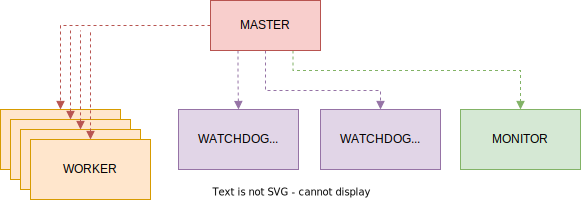
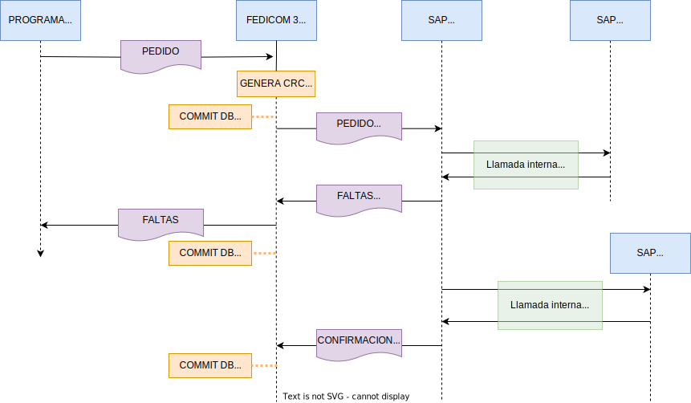

# Esquema de la aplicación
La aplicación Fedicom3 está compuesta de varios procesos diseñados para ser independientes. Todos son lanzados desde un proceso `MASTER` que es quien lanza al resto de procesos y los chequea periódicamente que estos estén operativos, para relanzarlos en caso de error en alguno de ellos.

Si echamos un ojo al árbol de procesos de la aplicación una vez que está en funcionamiento, veremos algo como lo siguiente:


```
PID		PPID COMMAND
19902	1 			node16 f3.js
19923	19902		\_ /usr/bin/node16 f3-worker.js
19924	19902		\_ /usr/bin/node16 f3-worker.js
19925	19902		\_ /usr/bin/node16 f3-worker.js
19926	19902		\_ /usr/bin/node16 f3-worker.js
19927	19902		\_ /usr/bin/node16 f3-watchdogPedidos.js
19930	19902		\_ /usr/bin/node16 f3-watchdogSqlite.js
19933	19902		\_ /usr/bin/node16 f3-monitor.js
```



  
## Proceso **master**
El proceso `master` se encarga de lanzar y monitorizar al resto de procesos.
Toda la aplicación parte de este proceso, que realiza la siguiente secuencia de arranque:

1. Lanza tantos procesos `worker` como se le indique por configuración.
2. Lanza el `watchdogPedidos` si se configura.
3. Lanza el `watchdogSqlite` si se configura.
4. Lanza el `monitor` si se configura.
5. Queda a la espera de eventos de cualquiera de los hijos que ha lanzado. Si alguno muere, lo relanza.
6. Cada 5 segundos (valor *hard-coded*) actualiza en la base de datos el estado de sus procesos.


## Procesos **worker**
Principalmente son los procesos encargado de recepcionar las transmisiones de las farmacias para enviarlas a SAP. 
Simplificando el caso mas icónico, cuando entra una transmisión con un pedido de una farmacia, hace lo siguiente:

1. Comprueba las credenciales del usuario.
2. Comprueba que la estructura del mensaje sea correcta y que no falte ningún campo obligatorio.
3. Genera el CRC del pedido.
4. Comprueba si el pedido es un duplicado y en caso afirmativo informa al cliente y termina el procesamiento.
5. Almacena la transmisión en su base de datos y la marca como `RECEPCIONADA`.
6. Lanza el pedido contra SAP para que este le devuelva incidencias.
7. Retorna las incidencias al cliente.
8. Marca la transmisión como `RESPONDIDA`.
9. Cuando SAP finaliza el proceso de creación del pedido, hace una llamada al conecntrador para confirmar el procesamiento del mismo, e indicar los números de pedido asociados a la transmisión. Cuando esto sucede, la transmisión se marca como `CONFIRMADA`.




Esta aplicación también se encarga de recepcionar las solicitudes de devoluciones y otras consultas. El proceso es similar al del Pedido en muchos casos, pero al tratarse de procesos menos críticos para el negocio, se simplifica el proceso.

## Proceso **watchdogPedidos**
Es el proceso que se encarga de recuperar transmisiones que han quedado en un estado incompleto. En un intervalo infinito, realiza búsquedas en la base de datos para identificar transmisiones que no han sido completadas con éxito (por ejemplo, una transmisión que no obtiene faltas de SAP ya que este estaba fuera de línea cuando se realizó la misma). Cuando encuentra transmisiones en estos estados, realiza las modificaciones necesarias para llevarlas a un estado válido (por ejemplo, retransmitiendolas a SAP). La lista de casos en los que una transmisión se considera en error, y las acciones que se realizan se detallan mas adelante en la documentación específica de este componente.

:::note
De todas las instancias de `watchdogPedidos` que haya corriendo en el clúster, solo una será la que estará operando a la vez. ¡No queremos que dos instancias estén relanzando pedidos a la vez!

👉 **La instancia que operará se define en la configuración del clúster.**
:::

## Proceso **watchdogSqlite**
Cuando una escritura a MongoDB falla, esta se almacena en una base de datos local SQLite para garantizar su persistencia. Este proceso vigila constantemente si aparecen entradas en esta base de datos local para volcarlas a MongoDB tan pronto como sea posible.


## Proceso **monitor**
El proceso `monitor` se encarga de atender a las peticiones de monitorización y control de la aplicación. Estas peticiones son, por ejemplo:
- Consultas de listados de transmisiones de los clientes.
- Consulta del estado de los procesos Fedicom.
- Consulta del estado de la base de datos.
- Consulta del estado de los concentradores.
- Consulta del estado de los balanceadores.

:::note
De todas las instancias de `monitor` que haya corriendo en el clúster, solo una será la que estará operando a la vez. Los motivos de diseño detrás de esta restricción los detallamos en el capítulo de [Monitorización](/docs/funcional/monitor) donde profundizaremos en este asunto.

👉 **La instancia que operará se define en la configuración del clúster.**
:::