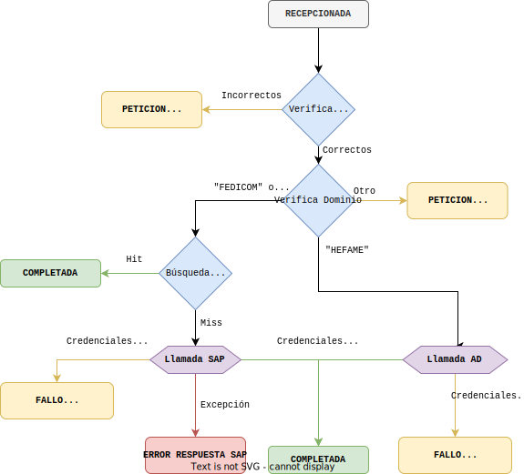

# Flujo de autenticación
El flujo de autenticación es el que permite que los usuarios obtengan un [token de autenticación](/docs/diseno/conceptos/tokens), el cual podrán utilizar para hacer llamadas al resto de los servicios.

## Llamada al servicio
Los clientes deberán llamar al endpoint `POST /authenticate`. El cuerpo del mensaje de esta llamada se espera que sea tal que: 

```js
{
  user: <string>,
  pasword: <string>,
  domain: <string, opcional>
}
```


## Procesamiento
Una vez recepcionada la llamada y registrada la transmisión correspondiente en el sistema, se procede al procesamiento de la petición.
<center>



</center>

1. Se verifica que el cuerpo del mensaje que envía el cliente contiene los valores obligados según el protocolo. Esto es, los campos `user` y `password`. 
2. Como el campo `domain` es opcional, en caso de existir, se comprueba que su valor corresponde con un dominio de autenticación válido. En caso de no existir, si el nombre del usuario comienza por `TR`, `TG` o `TP` se asigna por defecto el dominio a `TRANSFER`. De no cumplirse esto, se trata de una autenticación del dominio `FEDICOM`.
3. En caso de que la verificación de los pasos anteriores no fuera correcta, y se hubiera detectado algún error en el mensaje de la transmisión, la transmisión finaliza indicando al cliente el error encontrado, y marcándose la transmisión como `PETICION INCORRECTA`.
4. En función del dominio, se invoca al método de autenticación que proceda:
	1. Dominios `FEDICOM` y `TRANSFER`, se realiza la [**autenticación contra SAP**](#autenticación-contra-sap).
	2. Dominio `HEFAME`, se realiza la [**autenticación contra AD**](#autenticación-contra-ad).
	3. Resto de dominios: No se permite la expedición de tokens para ningún otro dominio, por lo que se indica al cliente el error encontrado, y se finaliza la transmisión como `PETICION INCORRECTA`.

### Autenticación contra SAP
Las verificaciones de credenciales contra SAP se realizan de la siguiente manera:
1. Se comprueba de la caché del concentrador (se consulta la colección `cacheUsuarios` de la base de datos) si ya existe una entrada para el usuario. En caso de encontrar la entrada y que las credenciales transmitidas coincidan con las que hay en caché, se genera y envía un token al cliente, y la transmisión finaliza como `COMPLETADA`. En caso de que exista la entrada en caché, pero las credenciales no coincidan, se continúa la ejecución.
2. En caso de no encontrar las credenciales correctas en la caché, se realiza una llamada a SAP para que este nos indique si las credenciales son correctas o no. SAP realiza esta comprobación mirando en las tablas `YVCLIENTES_FEDI` o `YVLABORATOR_FEDI`.
	1. En caso de que SAP indique que las credenciales son correctas, se genera y envía un token al cliente, y la transmisión finaliza en estado `COMPLETADA`. También se actualiza en la caché de credenciales de usuario.
	2. En caso de que SAP indique que las credenciales no son correctas, se responde el error al cliente y la transmisión finaliza en estado `FALLO AUTENTICACION`.
	3. En caso de excepción durante la comunicación con SAP, para no cortar el servicio, se genera y envía un token para el cliente, aun sin haber podido comprobar que las credenciales del mismo sean correctas. En este caso la transmisión finaliza en estado `ERROR RESPUESTA SAP`.


### Autenticación contra AD
Las verificaciones de credenciales contra SAP se realizan de la siguiente manera:
1. Se realiza una llamada contra el ActiveDirectory para que este nos indique si las credenciales son correctas o no. Este comprueba que las credenciales de la petición sean las de un usuario del dominio válido.
	1. En caso de que el AD indique que las credenciales son correctas, se genera y envía un token al cliente, y la transmisión finaliza en estado `COMPLETADA`. Dentro de este toquen se agregan los nombres de los grupos Fedicom del AD a los que pertenece el usuario.
	2. En caso de que AD indique que las credenciales no son correctas, u ocurra una excepción durante la comunicación con el AD, se responde el error al cliente y la transmisión finaliza en estado `FALLO AUTENTICACION`.


