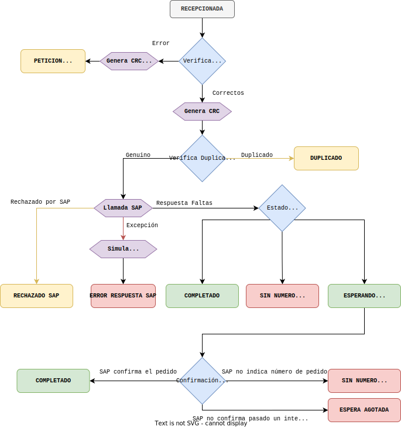

# Flujo de pedidos
El flujo de entrada de pedidos es el que permite que los usuarios solicitar la creación de un pedido en el sistema.

## Llamada al servicio
Los clientes deberán llamar al endpoint `POST /pedidos`. El cuerpo del mensaje de esta llamada se puede consultar en la [definición del protocolo](http://fedifar.net/fedicomv3/protocolo/), aquí nos centraremos en los campos obligatorios o que sean de especial relevancia para la creación del pedido en el backend.

```js
Pedido:
{
  codigoCliente: <string>,
  numeroPedidoOrigen: <string>,
  codigoAlmacenServicio: <string, opcional>,
  tipoPedido: <string, opcional>,
  lineas: [<Linea>, ...]
}
```

```js
Linea:
{
  orden: <number, opcional>,
  codigoArticulo: <string>,
  cantidad: <number>,
  valeEstupefaciente: <string, opcional>
}
```


Adicionalmente, en la creación del pedido es relevante el `usuario` y `dominio` al que pertenece el token de autenticación enviado por el cliente.


<center>



</center>

## Procesamiento
Una vez recepcionada la llamada y registrada la transmisión correspondiente en el sistema, se procede al procesamiento de la petición.


1. **[Verificación y saneamiento de campos](./saneamiento)**: Se verifica que el cuerpo del mensaje que envía el cliente contiene los valores obligados según el protocolo. Se verifica campo a campo que cumpla con los requisitos y se sanean los campos de entrada (se eliminan campos no definidos, se eliminan espacios al inicio y fin de los *strings*, se convierten los valores al tipo de dato definido en el protocolo, etc...). En la entrada de pedidos trataremos siempre de "arreglar" la entrada del pedido si no es correcta para que este pueda procesarse. Por ejemplo, si no se indica el campo cantidad, obligatorio en el objeto `Linea`, la estableceremos a 1, o si una línea contiene errores, anulamos dicha línea, pero no el resto. Solo en casos extremos rechazaremos el mismo. 

2. **[Cálculo del CRC del pedido](./crc)**: El CRC es un valor que identifíca a cada pedido único del cliente. Esto es, dos pedidos que sean "iguales" tendrán el mismo CRC. Este valor permite al sistema llevar control del ciclo de vida del pedido, como veremos mas adelante, como por ejemplo: tener el control de transmisiones de pedidos recibidas por duplicado, retransmisiones a SAP de los mismos o la confirmación de la creación del pedido.

3. En caso de que la verificación del paso 1 no fuera correcta, la transmisión finaliza indicando al cliente el error encontrado, y marcándose la transmisión como `PETICION INCORRECTA`. 

4. **[Comprobación de duplicados](./crc)**: Se comprueba si el pedido es un duplicado de otro. Para esto se utiliza el CRC generado anteriormente. En caso de encontrar que la solicitud de crear pedido que estamos tratando es un duplicado de otra se le responderá al cliente una copia de la respuesta que se dio con el pedido original, a la cual se le adjunta una incidencia informando de que el pedido es un duplicado de otro. La transmisión finaliza en con estado `DUPLICADO`.

5. **[Se envía el pedido a SAP](./pedido-sap)**: Esta petición incluye el cuerpo del pedido que previamente hemos saneado, a la que se le adjunta cierta inforamción que SAP necesitará. 

6. **[Se procesa la respuesta devuelta por SAP](./respuesta-sap)**:
	1. En caso de que la comunicación con SAP no pueda realizarse por **a)** fallo de red, **b)** respuesta incomprensible o **c)** error HTTP 4xx/5xx, se inicia la simulación de faltas del pedido. En este caso, se genera una respuesta para el cliente en el que se indican todos los artículos en falta, y se añade el mensaje de incidencia `PED-WARN-001: Pedido recibido pero pendiente de tramitar`. El pedido queda en estado `ERROR RESPUESTA SAP`.
	2. Si SAP devuelve una respuesta de errores (esto es, un array de incidencias), el pedido se entiende rechazado y pasa al estado `RECHAZADO SAP`. Estos casos se dan, por ejemplo, cuando el cliente no existe o cuando este está bloqueado por motivos financieros. Cuando ocurren estos casos, se sanean las incidencias y se envían al cliente. Nótese que por acuerdo con SAP, las incidencias cuyo código comienzan con `SAP-IGN` no se informan y en su lugar se envía un mensaje de incidencia `PED-ERR-999: No se pudo guardar el pedido. Contacte con su comercial.` al cliente. 
	3. Si SAP devuelve una respuesta de faltas normal, esta se sanea y se devuelve al cliente. En esta respuesta SAP nos indicará el estado al que debe pasar el pedido: `COMPLETADO` si el pedido ha sido creado, `SIN NUMERO PEDIDO SAP` si no ha sido creado, o `ESPERANDO NUMERO PEDIDO` si está en cola para ser creado. En este último caso, cuando el pedido se complete en SAP (o falle), SAP lo indicará llamando al concentrador (ver Paso 8).

7. **[Se generan los metadatos del pedido](./metadatos)**.

8. Cuando un pedido queda `ESPERANDO NUMERO PEDIDO`, se espera que SAP confirme la creación del mismo mediante una llamada al concentrador. Este paso ocurre de manera asíncrona con respecto al flujo de entrada del pedido descrito anteriormente. Cuando SAP realiza esta llamada, puede ser que indique que el pedido ha sido finalmente creado, pasando a `COMPLETADO` o que no tienen número de pedido, pasandoa  `SIN NUMERO PEDIDO SAP`. Si SAP tarda demasiado en confirmar la creación (o fallo en la creación) del pedido, el proceso [`watchdogPedidos`](/docs/sistemas/aplicacion/esquema#proceso-watchdogpedidos) lo marcará como `ESPERA AGOTADA`.